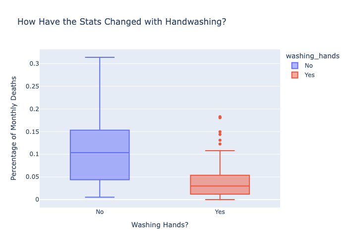
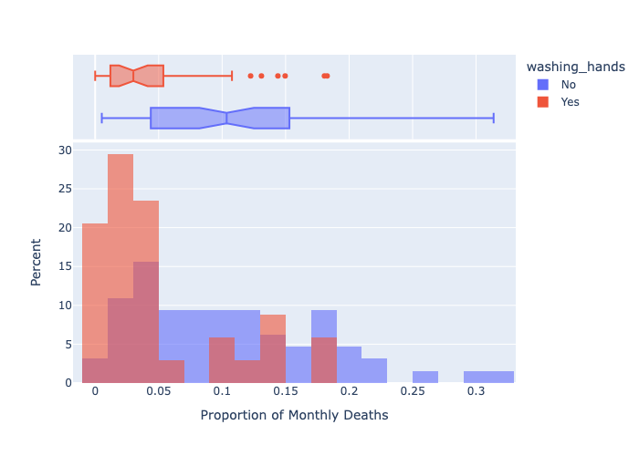
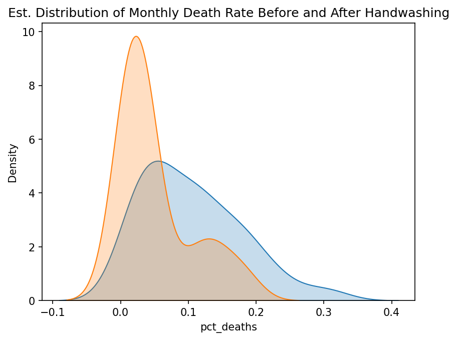
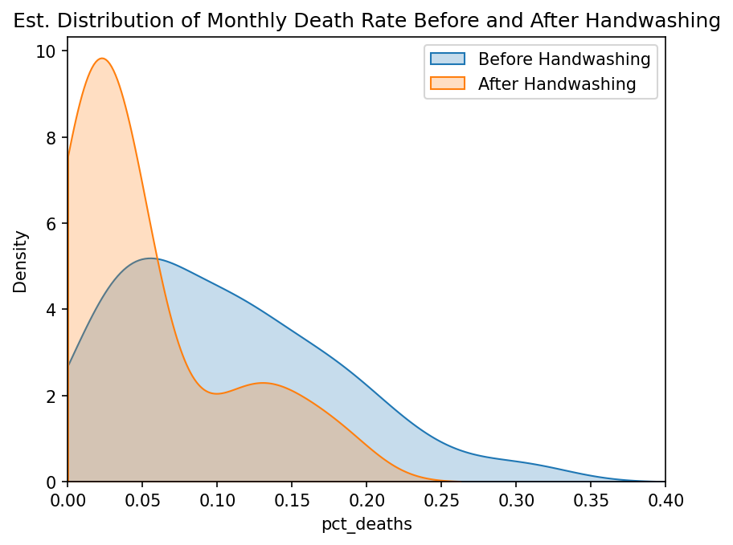

# Semmelweis Handwashing Data Analysis

In 1840s Vienna, roughly one in ten women died during childbirth at Vienna General Hospital — a rate that remained stubbornly high even as the science of medicine advanced. Dr Ignaz Semmelweis noticed that one of the hospital's two maternity clinics was dramatically more lethal than the other and suspected a cause that no one else was willing to accept. This analysis re-examines the original hospital records he published in 1861 to answer a single question: did mandatory chlorine handwashing, introduced in June 1846, actually save lives?

The data covers 98 monthly observations spanning 1841 to 1849. The pipeline walks from raw counts through death-rate computation, clinic comparison, time-series splitting, distributional analysis, and a formal hypothesis test. The central finding is unambiguous: the average monthly death rate dropped from 10.5% before handwashing to 5.0% after, a reduction confirmed statistically significant at p < 0.01 (p ≈ 0.00025) by an independent-samples t-test.

Clinic 1, staffed by doctors who also performed autopsies, carried a death rate roughly three times higher than Clinic 2, staffed by midwives with no autopsy contact. That structural difference is the analytical key — it isolates the contamination hypothesis without a controlled experiment. The data is taken directly from Semmelweis's published tables; no external services or APIs are required.

---

## Table of Contents

1. [Quick Start](#1-quick-start)
2. [Analysis Flow](#2-analysis-flow)
3. [Key Findings](#3-key-findings)
4. [Visualisations](#4-visualisations)
5. [Dataset Schema](#5-dataset-schema)
6. [Architecture](#6-architecture)
7. [Operations Reference](#7-operations-reference)
8. [Background](#8-background)
9. [Dependencies](#9-dependencies)
10. [Portfolio Integration](#10-portfolio-integration)

---

## 1. Quick Start

```bash
git clone https://github.com/xavier-oc-programming/semmelweis-handwashing-data-analysis.git
cd semmelweis-handwashing-data-analysis
pip install -r requirements.txt
jupyter notebook
```

Open `notebooks/analysis/semmelweis_handwashing_analysis.ipynb` to run the full analysis.

---

## 2. Analysis Flow

```
pipeline
    │
    │  ── [Ingestion] ────────────────────────────────────────────────
    ├── pd.read_csv()  →  annual_deaths_by_clinic.csv  →  df_yearly
    ├── pd.read_csv()  →  monthly_deaths.csv           →  df_monthly
    │
    │  ── [Exploration] ──────────────────────────────────────────────
    ├── .shape / .info() / .describe()  →  structure and stats
    ├── .duplicated() / .isna()         →  data quality check
    ├── prob = deaths.sum() / births.sum()  →  overall mortality rate
    │
    │  ── [Transformation] ───────────────────────────────────────────
    ├── df['pct_deaths'] = deaths / births        →  monthly death rate
    ├── pd.to_datetime()                          →  parse date column
    ├── boolean filter on date                   →  before / after split
    ├── np.where()                               →  washing_hands label
    │
    │  ── [Insight] ──────────────────────────────────────────────────
    ├── Clinic comparison  →  Clinic 1 death rate ~3× higher than Clinic 2
    ├── Handwashing split  →  10.5% → 5.0% average monthly death rate
    ├── t-test (p < 0.01) →  reduction is statistically significant
    │
    │  ── [Visualisation] ────────────────────────────────────────────
    └── plotly box + histogram / seaborn KDE  →  charts saved to plots/
```

---

## 3. Key Findings

| Metric | Before June 1846 | After June 1846 |
|--------|-----------------|----------------|
| Avg. monthly death rate | ~10.5% | ~5.0% |
| Absolute reduction | — | ~5.5 pp |
| Relative reduction | — | ~52% |
| p-value (t-test) | — | 0.00025 |

- **Overall mortality**: ~10% of women who gave birth at Vienna General Hospital in the 1840s died, primarily from childbed fever
- **Clinic 1 vs Clinic 2**: Clinic 1 (doctors with autopsy duties) had an average death rate roughly 3× higher than Clinic 2 (midwives only) — this structural gap predates the handwashing intervention and isolates the contamination mechanism without a controlled experiment
- **Statistical significance**: independent-samples t-test yields t = 3.80, p ≈ 0.00025 — well below the 1% threshold; the improvement is not due to chance

---

## 4. Visualisations

All charts are saved to `plots/` when the notebook is run.

### Death Rate Distribution: Before vs After Handwashing



The median monthly death rate fell from ~10% to ~3.5%. The entire distribution shifted down — this is not driven by outlier removal.

---

### Overlapping Distributions (Normalised Histogram)



Normalised to percent to account for the unequal period lengths (63 months before, 35 after). The post-handwashing distribution is concentrated at lower death rates with minimal overlap above 10%.

---

### Kernel Density Estimate — Default Parameters



Default KDE parameters extend the density curve into negative values — a mathematical artefact with no physical meaning.

---

### Kernel Density Estimate — Clipped to [0, 1]



Clipping to `[0, 1]` keeps the estimate grounded. The two distributions barely overlap: before handwashing peaks near 10%, after handwashing peaks near 2–3%.

---

## 5. Dataset Schema

### `data/annual_deaths_by_clinic.csv`

| Column | Type | Description |
|--------|------|-------------|
| year | int | Calendar year (1841–1846) |
| births | int | Total births at that clinic that year |
| deaths | int | Total maternal deaths that year |
| clinic | string | `clinic 1` (doctors) or `clinic 2` (midwives) |

### `data/monthly_deaths.csv`

| Column | Type | Description |
|--------|------|-------------|
| date | date | First day of the month (1841-01-01 to 1849-03-01) |
| births | int | Total births that month |
| deaths | int | Total maternal deaths that month |

**Computed columns added at runtime:**

| Column | Added to | Description |
|--------|----------|-------------|
| pct_deaths | df_yearly, df_monthly | deaths / births — proportion of patients who died |
| washing_hands | df_monthly | `'No'` before June 1846, `'Yes'` after |

---

## 6. Architecture

```
semmelweis-handwashing-data-analysis/
│
├── notebooks/
│   ├── analysis/
│   │   └── semmelweis_handwashing_analysis.ipynb  # Full analysis: exploration → clinic comparison → distributions → t-test
│   │
│   └── concepts/                    # Annotated reference notebooks
│       ├── 00__Overview.ipynb
│       ├── 01__Preliminary_Exploration.ipynb
│       ├── 02__Yearly_Data_By_Clinic.ipynb
│       ├── 03__Effect_of_Handwashing.ipynb
│       ├── 04__Distributions_and_Statistical_Significance.ipynb
│       └── 05__Summary.ipynb
│
├── data/
│   ├── annual_deaths_by_clinic.csv  # Yearly births and deaths by clinic (1841–1846)
│   └── monthly_deaths.csv           # Monthly births and deaths (1841–1849)
│
├── plots/                           # Charts saved at 150 dpi on notebook run
│   ├── death_rate_box.png
│   ├── death_rate_histogram.png
│   ├── death_rate_kde_unclipped.png
│   └── death_rate_kde.png
│
├── notebook_web_render/             # Rendered HTML for GitHub Pages
│   └── index.html                   # Generated by CI/CD on every push to main
│
├── docs/
│   └── COURSE_NOTES.md
│
├── .github/
│   └── workflows/
│       └── publish_notebook.yml     # Renders and deploys notebook on push
│
├── requirements.txt
├── .gitignore
└── README.md
```

---

## 7. Operations Reference

| Value | Location | Description |
|-------|----------|-------------|
| `'../../data/annual_deaths_by_clinic.csv'` | semmelweis_handwashing_analysis.ipynb | Relative path to yearly dataset |
| `'../../data/monthly_deaths.csv'` | semmelweis_handwashing_analysis.ipynb | Relative path to monthly dataset |
| `pd.to_datetime('1846-06-01')` | semmelweis_handwashing_analysis.ipynb | Handwashing start date |
| `'{:,.2f}'.format` | semmelweis_handwashing_analysis.ipynb | Float display format for pandas output |
| `dpi=150` | Matplotlib figures | Output resolution for saved plots |

---

## 8. Background

100 Days of Code — The Complete Python Pro Bootcamp · Day 80 · Topics: Pandas, Matplotlib, Plotly, Seaborn, SciPy statistics

→ [docs/COURSE_NOTES.md](docs/COURSE_NOTES.md)

Dr Semmelweis's full text (German original): http://www.deutschestextarchiv.de/book/show/semmelweis_kindbettfieber_1861

English translation: http://graphics8.nytimes.com/images/blogs/freakonomics/pdf/the%20etiology,%20concept%20and%20prophylaxis%20of%20childbed%20fever.pdf

---

## 9. Dependencies

| Module | Used in | Purpose |
|--------|---------|---------|
| pandas | all notebooks | DataFrames, CSV I/O, date parsing |
| numpy | semmelweis_handwashing_analysis.ipynb | `np.where()` for categorical labelling |
| matplotlib | semmelweis_handwashing_analysis.ipynb | Figure setup, time axis formatting |
| seaborn | semmelweis_handwashing_analysis.ipynb | KDE plots with clipping |
| plotly | semmelweis_handwashing_analysis.ipynb | Interactive box and histogram charts |
| kaleido | semmelweis_handwashing_analysis.ipynb | Static image export for plotly (`write_image`) |
| scipy | semmelweis_handwashing_analysis.ipynb | `stats.ttest_ind()` — independent samples t-test |
| notebook | — | Jupyter notebook server |

---

## 10. Portfolio Integration

Rendered notebook (outputs and charts only, no code):
https://xavier-oc-programming.github.io/semmelweis-handwashing-data-analysis/

Regenerated automatically via GitHub Actions on every commit to `notebooks/analysis/semmelweis_handwashing_analysis.ipynb`.

To regenerate manually:

```bash
jupyter nbconvert --to html --no-input \
  --output index.html \
  notebooks/analysis/semmelweis_handwashing_analysis.ipynb
mv index.html notebook_web_render/index.html
```
